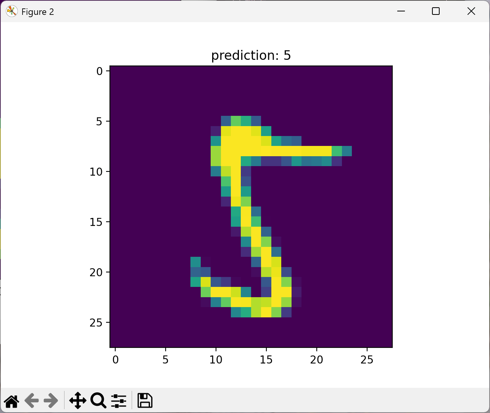

# PyTorch MNIST Classifier (手写数字识别)


## 📖 项目简介
本项目使用 PyTorch 实现了一个轻量级的前馈神经网络（MLP），用于对 MNIST 数据集中的手写数字进行分类识别。项目包含了完整的数据处理、模型构建、训练流程以及可视化评估模块。适合作为深度学习入门或快速验证 PyTorch 环境的 Baseline 项目。

## ⚙️ 模型架构与超参数
本模型采用 4 层全连接网络结构：
- **输入层**: 784 (对应 28x28 像素图像展平)
- **隐藏层**: 3 层 Linear 线性层 (每层 64 个神经元)，使用 `ReLU` 激活函数
- **输出层**: 10 (对应 0-9 十个类别)，使用 `LogSoftmax` 输出概率分布
- **优化器**: Adam (Learning Rate = 0.001)
- **损失函数**: NLLLoss (Negative Log Likelihood Loss)
- **训练轮数**: 2 Epochs
- **Batch Size**: 15

*(预期性能：在经过 2 个 Epoch 的训练后，测试集准确率通常可达到 95% 以上)*

## 📂 项目结构
```text
.
├── LICENSE # MIT 开源许可证
├── main.py # 核心程序：模型定义、训练与评估
├── pyproject.toml # 项目配置与依赖声明
├── uv.lock # 依赖版本锁定文件
├── result.png # 预测结果示例图
└── README.md # 项目说明文档
```

## 🚀 快速开始

### 1\. 环境准备

确保你的计算机上已安装 Python 环境。推荐使用 [uv](https://github.com/astral-sh/uv) 或传统的 `pip` 进行依赖管理。

**方式一：使用 uv（推荐，速度更快）**

```bash
# 如果你配置了 pyproject.toml 或 uv.lock
uv sync
# 或者直接安装依赖
uv pip install torch torchvision matplotlib
```

**方式二：使用 pip**

```bash
pip install torch torchvision matplotlib
```

### 2\. 运行程序

在命令行终端中执行以下命令：

```bash
python main.py
```

### 3\. 运行流程说明

1.  **自动下载数据**：程序首次运行会自动将 MNIST 数据集下载到当前目录。
2.  **模型训练**：输出初始准确率后，开始 2 个 Epoch 的迭代训练，并在终端实时打印每个 Epoch 结束后的测试集准确率。
3.  **结果可视化**：训练结束后，会弹出 matplotlib 窗口，展示 4 张测试集样本的原始图像及其模型预测结果。

## 📸 运行结果示例


*(结果说明：标题显示了预测结果为 5 ，下方显示了原始图片)*

## 📄 许可证

本项目采用 [MIT License](https://www.google.com/search?q=LICENSE) 开源协议。
